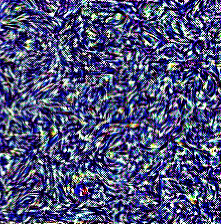
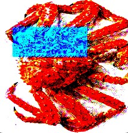
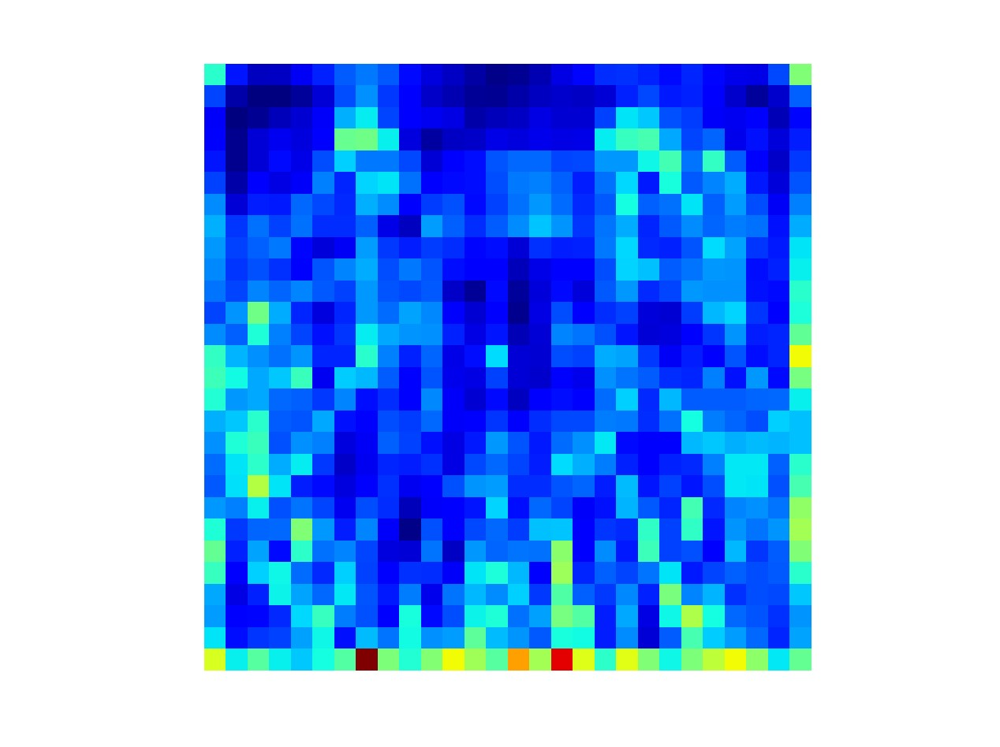
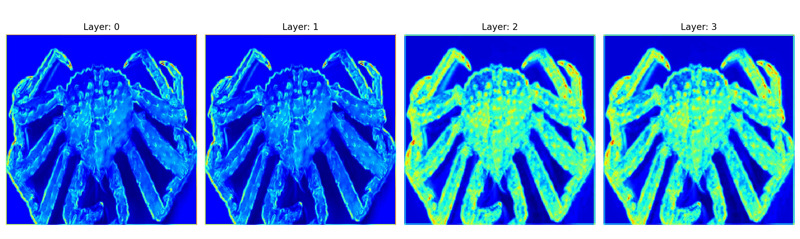

# implement-gatys-2015
Implementation of "A Neural Algorithm of Artistic Style" by (Gatys et al, 2015). Since this
well-known paper is also based on "Texture Synthesis using Convolutional Neural Networks" by
(Gatys et al, 2015), this also includes an implementation of that paper which can be interfaced
with independently by using the StyleExtractor class.

# Style Extraction
The key insights from the Gatys papers lie in the extraction of style, or put 
differently, in the results related to the problem of texture transfer.

Here's an example of generated style, where we started with a random white noise
image and resulted in a style close to Van Gogh's Starry Night:

  

# Content Extraction
This implementation provides an interface for content extraction, the ContentExtractor class.
By itself, content generation can still yield some interesting results.  

For instance, one can generate content on a modified version of the original image with 
a portion of the original image blocked out. As the generated output shows, the content 
generator "fills in" the content of the blocked out portion while keeping the "style" 
(in this case, color) the same:  

  

We can visualize the activations in content layer that we specify as well:

  

# VGG Wrapper
A wrapper is provided to the VGG model, which allows a higher level interaction
with the model than PyTorch gives by default. For example, the wrapper allows 
a visualization of various activations of the VGG model.  

# References
Gatys, L. A., Ecker, A. S., & Bethge, M. (2015). A neural algorithm of artistic style. arXiv preprint arXiv:1508.06576.

Gatys, L., Ecker, A. S., & Bethge, M. (2015). Texture synthesis using convolutional neural networks. Advances in neural information processing systems, 28.

Gatys, L. A., Ecker, A. S., & Bethge, M. (2016). Image style transfer using convolutional neural networks. In Proceedings of the IEEE conference on computer vision and pattern recognition (pp. 2414-2423).
